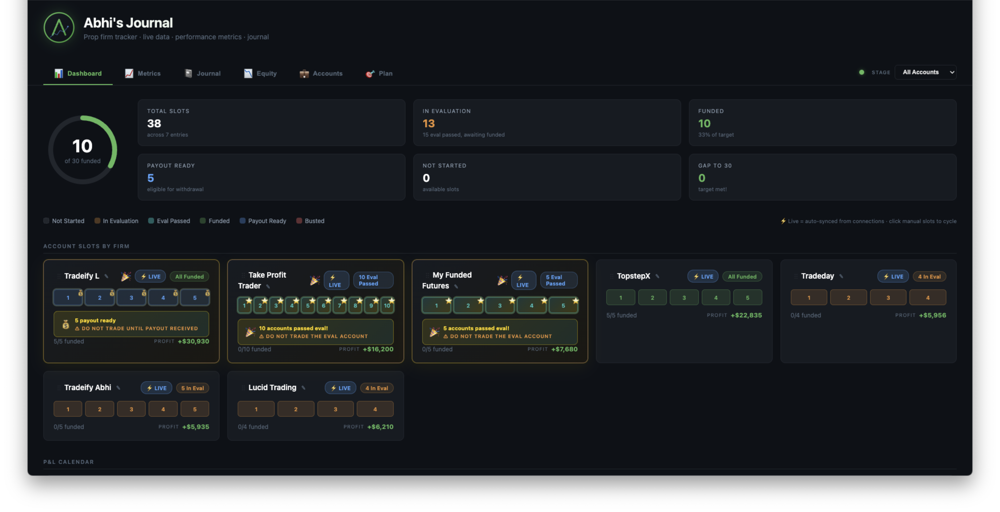

# Prop Firm Journey

A self-hosted trading journal for futures prop firm traders. Track every account across every firm, log your trades, watch your drawdown cushion in real time, and measure your performance with the metrics that actually matter.

Everything runs on your own machine. No cloud, no telemetry, no signups.



---

## Why

Most prop firm dashboards show you balances. They don't show you:

- How close you are to busting *right now*, in absolute dollars
- Your Sharpe / Sortino / profit factor across **all** your firms combined
- Which hours of the day you actually make money vs lose money
- Calendar heatmap of every day you traded
- A celebration when you pass eval and a do-not-trade warning so you don't blow it before payout

This does. It also remembers everything across sessions, lets you bulk-import five accounts at once from a screenshot, and works with any prop firm that gives you a CSV export.

---

## Features

### Core

- **Multi-firm tracking** — TPT, MFFU, Apex, Tradeify, Topstep, Bulenox, FundedNext, anything (custom firm names supported)
- **Account lifecycle stages** — In Evaluation → Eval Passed → Funded → Payout Ready → Busted, auto-detected from your trades + drawdown rules
- **Per-account drawdown calculator** — static / EOD trailing / intraday trailing, with lock-at thresholds
- **Live cushion gauge** — see your distance to bust as a $ amount and a colored bar on every account card
- **Celebration UI** — when an account passes eval, the card lights up gold with a "DO NOT TRADE — wait for payout" warning so you don't blow it

### Importing

- **CSV upload** — Tradovate Orders export, TopstepX trade history, generic CSVs (auto-detected format)
- **Bulk import** — upload a screenshot of your prop firm dashboard + one CSV → OCR detects every account, parses balances/drawdown, clones trades across all of them
- **TopstepX share URL import** — paste a public `topstepx.com/share/stats?share=...` URL and it pulls all your trades automatically
- **Idempotent re-imports** — deterministic trade IDs mean you can re-upload the same CSV daily without creating duplicates

### Analytics

- **P&L Calendar** — GitHub-style heatmap of every trading day, color-coded by net P&L, with month totals
- **Performance metrics** — Sharpe, Sortino, Calmar, Recovery Factor, Profit Factor, Expectancy, R-multiples, max drawdown, max win/loss streaks, consistency score
- **Pattern recommendations** — best/worst hours, best/worst days of week, best/worst symbols, over-trading detection, revenge-trading detection
- **Equity curves** — per-account or aggregate, with peak overlay and DD threshold line
- **Unified journal** — every trade across every account in one filterable table, with notes/tags/setup/rating per trade

### UX

- **6 top-level views** — Dashboard, Metrics, Journal, Equity, Accounts, Plan
- **Sticky primary nav** — view tabs always visible
- **Global stage filter** — filter every view by current account stage (eval, funded, payout ready, busted)
- **Drag-and-drop firm reordering** — arrange your firm cards however you want, persists across sessions
- **Inline edit panel** — pencil icon on each firm card lets you rename and bulk-stage all accounts at once
- **Dark mode by default** — designed for terminals at 3am

---

## Requirements

- **macOS** (the OCR helper uses Apple's Vision framework via Swift)
  - Linux/Windows users: bulk import via screenshot won't work, but everything else does. CSV upload still works.
- **Node.js 18+**
- **Swift** (comes with Xcode Command Line Tools — `xcode-select --install`) — only needed if you want to use the screenshot OCR feature

---

## Quick Start

```bash
git clone https://github.com/YOUR_USERNAME/prop-firm-journey.git
cd prop-firm-journey/server
npm install
node server.js
```

Open `http://127.0.0.1:3847/index.html` in your browser. Done.

---

## How to use

### 1. Create a connection

A *connection* is a group of accounts under one prop firm + trader. Click **Accounts → + Add Connection**, pick the firm, owner, and a label (e.g. "MFFU 50K Group"). This creates an empty bucket.

### 2. Import trades

You have three options:

#### Option A: Bulk Import (screenshot + CSV)

1. Click **📷 Bulk Import**
2. Upload a screenshot of your prop firm dashboard showing all accounts
3. Upload one CSV of orders from any single account
4. The system OCRs the screenshot to extract account names + balances + drawdown rules, then clones the trades across every detected account

This is the fastest way to set up 5+ accounts on a copier.

#### Option B: TopstepX share URL

1. In TopstepX, click "Share Stats" on any account → copy the public URL
2. Click **📷 Bulk Import** → switch source to **🔗 TopstepX Share URL**
3. Paste the URL → import

The system fetches all your trades via TopstepX's public stats API (no auth needed). Combine with a screenshot to clone across multiple accounts.

#### Option C: Direct CSV upload to one connection

1. On any existing connection card, click **Upload CSV**
2. Pick the CSV → done

### 3. Configure drawdown rules

On any account card in the **Accounts** view, click the ⚙ icon to set:

- Starting balance
- Drawdown type (static / EOD trailing / intraday trailing)
- Drawdown amount ($)
- Lock-at threshold (the balance at which trailing DD freezes)
- Profit target (for auto-detecting "Eval Passed")

Once configured, the system tracks your real-time cushion and auto-flips the stage when you hit the profit target.

### 4. Use the journal

- **Dashboard** — progress ring, firm cards, calendar heatmap
- **Metrics** — Sharpe, Sortino, win rate, hour/day patterns, recommendations
- **Journal** — every trade in one table, filterable by firm/owner/symbol/date, exportable to CSV
- **Equity** — per-account or aggregate equity curves with DD threshold line
- **Accounts** — live cards with cushion gauges + connection management
- **Plan** — phase timeline, cost projections, prop firm recommendations

---

## Supported CSV formats

The importer auto-detects:

- **Tradovate Orders** export — the format you get from clicking "Export" on the Orders tab
- **TopstepX trade history** export
- **Generic** CSVs with `Symbol`, `Entry Price`, `Exit Price` columns

Adding a new format takes ~30 lines in `server/csv-import.js`. PRs welcome.

---

## File layout

```
prop-firm-journey/
├── index.html                  the entire frontend (single HTML file)
├── README.md
├── LICENSE
├── .gitignore
└── server/
    ├── package.json
    ├── server.js               Express app
    ├── db.js                   SQLite schema + queries
    ├── csv-import.js           CSV parsers (Tradovate, TopstepX, generic)
    ├── account-parser.js       Screenshot OCR text → account rows
    ├── ocr.js                  Node wrapper around the Swift OCR helper
    ├── ocr.swift               macOS Vision framework helper
    ├── topstepx-share.js       Public TopstepX share URL fetcher
    ├── sync.js                 Daily stats rollup
    ├── patterns.js             Pattern analysis (hours, days, symbols, recs)
    ├── metrics.js              Sharpe / Sortino / Calmar / streaks / R-mult
    ├── drawdown.js             Static / EOD / intraday trailing DD calc
    ├── equity.js               Equity curve generator
    └── .data/                  ⚠ NOT COMMITTED — your SQLite DB lives here
```

---

## Privacy

- The server binds to `127.0.0.1` only. It refuses connections from anything other than your local machine.
- Your trade data lives in `server/.data/trades.db` (gitignored) on your computer. Nothing is uploaded anywhere.
- No telemetry. No analytics. No phone-home.
- The only outbound network calls the server makes are to `userapi.topstepx.com` (only when you explicitly use the TopstepX share URL feature) and the standard public TopstepX share endpoint.
- All other features are fully offline.

To wipe everything: `rm -rf server/.data/` and restart.

---

## Data model

The SQLite schema (auto-created on first run):

| Table | What it holds |
|---|---|
| `connections` | A firm + owner + label group (e.g. "MFFU · Trader 1 · 50K Group") |
| `accounts` | Individual accounts under a connection. Has balance, P&L, status. |
| `account_configs` | Per-account drawdown rules (start balance, DD amount, lock-at, profit target, lifecycle stage override) |
| `fills` | Raw fills from CSV imports (one row per execution) |
| `trades` | Closed positions paired from fills via FIFO |
| `trade_notes` | Per-trade note, tags, setup name, 1-5 self-rating |
| `day_notes` | Per-day journal entry with mood + tags |
| `daily_stats` | Aggregated daily stats per account (used by the calendar) |

---

## Roadmap / Ideas

- [ ] Linux/Windows OCR support (Tesseract.js fallback)
- [ ] More CSV format detectors (NinjaTrader, Sierra Chart, Apex)
- [ ] Cumulative payout tracking
- [ ] Goal tracking (custom milestones beyond the 30-funded preset)
- [ ] Public share view (read-only equity + stats, like TopstepX)
- [ ] Export entire journal to JSON for backup
- [ ] iOS/Android app via the same server backend

PRs welcome.

---

## License

[MIT](LICENSE) — free to use, fork, modify, sell, do whatever. Attribution appreciated but not required.

---

## Support

This is a solo project, no support contract. Open an issue if you find a bug. PRs welcome.

If you want to say thanks, star the repo or post a screenshot of your equity curve on X/Reddit.
